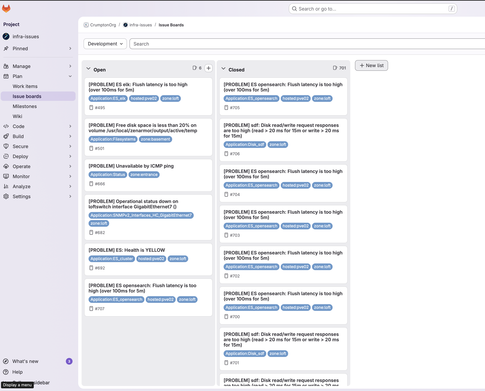

# Zabbix → GitLab Issues Webhook

GitLab-first, schema-free, debug-friendly

## Media Type

### Parameter Variables

| Name                  | Example                               |
| --------------------- | ------------------------------------- |
| `gitlab_url`          | `https://gitlab.internal/`            |
| `gitlab_token`        | `glpat-xxxxx`                         |
| `gitlab_project_id`   | `42`                                  |
| `gitlab_issue_iid`    | `{EVENT.TAGS.__zbx_gitlab_issue_iid}` |
| `HTTPProxy`           | *(optional)*                          |
| `alert_message`       | `{ALERT.MESSAGE}`                     |
| `alert_subject`       | `{ALERT.SUBJECT}`                     |
| `event_recovery_value`| `{EVENT.RECOVERY_VALUE}`              |
| `event_source`        | `{EVENT.SOURCE}`                      |
| `event_tags_json`     | `{EVENT.TAGSJSON}`                    |
| `event_update_action` | `{EVENT.UPDATE_ACTION}`               |
| `event_update_message`| `{EVENT.UPDATE_MESSAGE}`              |
| `event_update_status` | `{EVENT.UPDATE_STATUS}`               |
| `event_update_user`   | `{EVENT.UPDATE_USER}`                 |
| `event_value`         | `{EVENT.VALUE}`                       |
| `trigger_description` | `{TRIGGER.DESCRIPTION}`               |

### Media Type Non Variable Parameters

| Name                       | Setting                                       |
| -------------------------- | --------------------------------------------- |
| `process_tags`             | `true`                                        |
| `Include event menu entry` | `true`                                        |
| `Menu entry name`          | `GitLab: {EVENT.TAGS.__zbx_gitlab_issue_iid}` |
| `Menu entry URL`           | `{EVENT.TAGS.__zbx_gitlab_issue_iid}`         |

## Installation

Install the webhook.js into a new media type in Zabbix, set the parameters as shown above,
and don't forgot to add Message Templates.

---

## Project Structure

```text
zbx-to-gitlab-issue/
├── webhook.js          # GitLab webhook entry point
├── debug-context.js    # Local debug payloads for VSCode
├── package.json        # Node.js dependencies
├── launch.json         # VSCode debug configuration
└── README.md
```

---

## Getting Started

### Prerequisites

* Zabbix 6.4 or higher
* GitLab project with webhook access and API access

## Example


